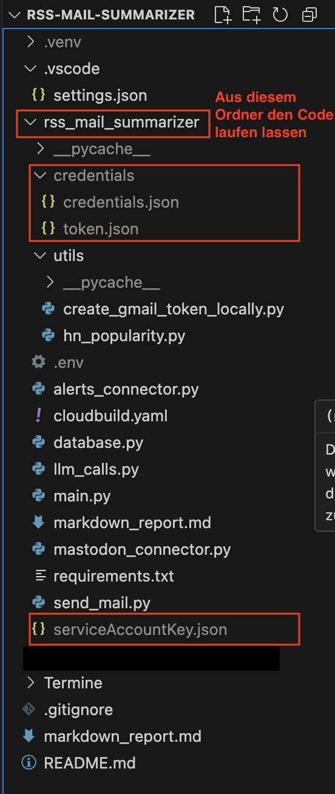

# RSS Mail Summarizer:
Der RSS Mail Summarizer sammelt automatisch neue Beiträge aus dem Mastodon-Kanal pinboard.pop sowie alle Artikel zu Carlo Masala, die über Google Alerts gefunden werden, fasst sie zusammen und versendet die Ergebnisse zweimal täglich per Gmail. Die einzelnen Artikel werden thematisch geordnet, mit einer geschätzten Lesezeit versehen und – falls verfügbar – um die jeweilige Punktezahl auf Hacker News ergänzt.

Bitte beim lokalen ausführen des Codes aufpassen, dass dies aus dem Folder **rss_mail_summarizer** geschieht und nicht aus dem root folder oder einem der anderen Unterordner, denn die Filepfade sind entsprechend im Code angegeben.

## .env File:
Um das Programm zu verwenden, müssen folgende Umgebungsvariablen in einer .env file hinterlegt werden:

- **GEMINI_API_KEY**: (kann hier erstellt werden: https://ai.google.dev/gemini-api/docs/api-key?hl=de)

- **PROJECT_ID**: Für das deployen in google cloud und das lokale Testen dessen die entprechende Project des Google Cloud Projektes hinterlegen

- **SENDER_EMAIL**: (Die Mail-Adresse mit der die E-Mail versandt werden soll)

- **RECIPIENT_EMAIL**: (Die Mail-Adresse welche die E-Mail erhalten soll)

- **LOG_LEVEL**: Hier kann zwischen DEBUG, INFO, WARNING and ERROR unterschieden werden. Wenn nichts gesetzt wird, wird automatisch INFO verwendet. 

## Hinweise für die lokale Ausführung

Eine lokale Codeausführung MUSS aufgrund der hinterlegten Filepaths von dem unterordner "rss_mail_summarizer" geschehen. Die Credentials und serviceAccountKey.json müssen außerdem an folgender Stelle hinterlegt sein:



## Deployen:
Zum eigenen deployen müssen die folgenden Schritte unternommen werden.

### Veränderungen im Code:
Bei der rss-mail-summarizer/cloudbuild.yaml müssen die PROJECT_ID Werte, SENDER_EMAIL und RECIPIENT_EMAIL ersetzt werden. 
(Für eine lokale Ausführung in .env PROJECT_ID=IHRE_PROJECT_ID hinterlegen etc.)
Außerdem kann das LOG_LEVEL verändert werden, zur Auswahl stehen: DEBUG, INFO, WARNING and ERROR. Als Default Wert ist in der Cloudbuild.yaml DEBUG hinterlegt.

### APIs Aktivieren:
Für die weitere Bearbeitung müssen einige der APIs aktiviert werden. Am einfachsten geht das mit der Google Console (in der Webanwendung oder durch herunterladen einer entsprechenden Software in der eigenen Konsole):

```bash
gcloud services enable cloudbuild.googleapis.com \
                       cloudfunctions.googleapis.com \
                       cloudresourcemanager.googleapis.com \
                       cloudscheduler.googleapis.com \
                       artifactregistry.googleapis.com \
                       secretmanager.googleapis.com \
                       logging.googleapis.com \
                       firestore.googleapis.com \
                       run.googleapis.com \
                       aiplatform.googleapis.com
```
Alternativ können diese auch in der Web Benutzeroberfläche freigeschaltet werden.

Ein weiterer Hinweis: sie müssen für einige der Dienste ein Rechnungskonto bei dem Projekt hinterlegt haben.

### Dienstkonto:
Da Google es nicht mag, wenn das Admin-Service-Account verwendet wird, sollte an dieser stellte (unter IAM & Verwaltung --> Dienstkonten) ein Dienstkonto mit einer gut zu merkenden Emailadresse und erstmal ohne weitere Berechtigungen erstellt werden.

### Setzen von Variablen in der Cloud Console 
Zum leichteren ausführen einiger der Befehle weiter unten in der Anleitung können hier einmal die Variablen gesetzt werden und die anderen Befehle dann einfach kopiert und ausgeführt werden ohne weitere Anpassungen vornehmen zu müssen:

```bash
PROJECT_ID=$(gcloud config get-value project)

PROJECT_NO=$(gcloud projects describe $PROJECT_ID --format="value(projectNumber)")

IHRE_DIENSTKONTO_EMAIL=<Hier bitte die gerade gewählte E-Mail adresse einfügen>
```

### Firestore: 
Zunächst im Google Firestore eine Sammlung/Collection mit dem Namen "website" anlegen. Der Name der Datenbank kann dabei als Default belassen werden. Zum vollständigen Erstellen der Collection dann noch einen Dummy Eintrag einfügen, die Werte und Bezeichnungen sind dabei egal, notwendige "Spalten" werden dann automatisch vom Code angelegt. 

Für den Firestore wird nun ein privater JSON Schlüssel benötigt.

Um aus der lokalen Umgebung oder über gcloud Daten in die Firebase einspeichern zu können braucht es einen privaten Schlüssel (JSON) dafür:
- Unter IAM & Verwaltung --> Dienstkonten zu dem im letzten Abschnitt erstellten Dienstkonto gehen und drauf clicken.
- Beim Reiter "Schlüssel" auf "Schlüssel hinzufügen" clicken und neuen generieren als JavaScript Object Notation
- die JSON unter serviceAccountKey.json im Ordner rss_mail_summarizer speichern (für lokae Ausführung)
    - außerdem muss für die llm_youtube_calls.py das auch im Unterordner utils abgespeichert werden oder der Pfad SERVICE_ACCOUNT_LOCAL_FILE in der .py Datei angepasst werden
- Für das Deployment in der Google Cloud Weboberfläche nun zu Sicherheit --> Secret Manager navigieren und dort:
    - "secret erstellen"
    - name als "rss-firebase-key" vergeben
    - Inhalt der JSON einfügen
    - Erstellen
    - Zugriff gewähren an das Dienskonto (erst generell zum Secret Manager und dann das spezifische Secret):

```bash
 gcloud projects add-iam-policy-binding $PROJECT_ID \
  --member="serviceAccount:${IHRE_DIENSTKONTO_EMAIL}" \
  --role="roles/secretmanager.secretAccessor"
```

```bash
gcloud secrets add-iam-policy-binding rss-firebase-key \
  --member="serviceAccount:${IHRE_DIENSTKONTO_EMAIL}" \
  --role="roles/secretmanager.secretAccessor"
```

Außerdem nutzt die Funktion im Container dann folgendes Service Account, welches auch Zugriff braucht auf das Secret/ die Secrets:

```bash
gcloud secrets add-iam-policy-binding rss-firebase-key \
  --member="serviceAccount:${PROJECT_NO}-compute@developer.gserviceaccount.com"
  --role="roles/secretmanager.secretAccessor"
```
Damit auch in die Collection geschrieben werden kann, muss folgende Rolle auch vergeben werden:

```bash
gcloud secrets add-iam-policy-binding rss-firebase-key \
  --member="serviceAccount:${IHRE_DIENSTKONTO_EMAIL}" \
  --role="roles/datastore.user"
```
## Recipient and Sender Email

It is necessary to set two further secrets with the Recipient and Sender Email. 
Their names in Secret Manager are recipient-email and sender-email

Then they need to be granted these permissions:

```bash
gcloud secrets add-iam-policy-binding recipient-email \
  --member="serviceAccount:${IHRE_DIENSTKONTO_EMAIL}" \
  --role="roles/secretmanager.secretAccessor"

gcloud secrets add-iam-policy-binding recipient-email \
  --member="serviceAccount:${PROJECT_NO}-compute@developer.gserviceaccount.com" \
  --role="roles/secretmanager.secretAccessor"

gcloud secrets add-iam-policy-binding sender-email \
  --member="serviceAccount:${IHRE_DIENSTKONTO_EMAIL}" \
  --role="roles/secretmanager.secretAccessor"

gcloud secrets add-iam-policy-binding sender-email \
  --member="serviceAccount:${PROJECT_NO}-compute@developer.gserviceaccount.com" \
  --role="roles/secretmanager.secretAccessor"
```

### Alerts Connector

Der Alerts Connector ermöglicht es, automatisch Links aus Google Alerts E-Mails auszulesen, weiterzuverarbeiten und als erledigt zu markieren.  

Folgende Schritte sind dazu notwendig:

1. **Google Alerts einrichten**  
   - Besuchen: [https://www.google.com/alerts](https://www.google.com/alerts)  
   - Alert zu einem beliebigen Thema erstellen (z. B. *Carlo Masala*).  

2. **Labels und Filter in Gmail anlegen**  
   - Label erstellen:  
     - `alerts-carlo-masala`  
     - `alerts-carlo-masala-processed`  
   - Filter erstellen:  
     - Absender: `googlealerts-noreply@google.com`  
     - Aktion: *Inbox überspringen*  
     - Aktion: *Label anwenden* → `alerts-carlo-masala`  

3. **Ordner `credentials` anlegen**  
   - Auf oberster Ebene neben der `main.py`.  
   - Der Ordner wird genutzt, um Zugangsdaten und Token zu speichern.  

4. **`credentials.json` erstellen**  
   - [Google Cloud Console](https://console.cloud.google.com/) öffnen.  
   - **Gmail API aktivieren**:  
     - Menü → APIs & Dienste → Bibliothek → "Gmail API" suchen → *Aktivieren*.  
   - **OAuth-Zustimmungsbildschirm konfigurieren**:  
     - Menü → APIs & Dienste → OAuth-Zustimmungsbildschirm → *Get Started*  
     - Schritt 1: beliebige Werte eintragen  
     - Schritt 2: *Extern* auswählen  
     - Schritt 3: beliebige E-Mail-Adresse eintragen  
   - **OAuth-Client anlegen**:  
     - Menü → APIs & Dienste → Anmeldedaten → *Anmeldedaten erstellen* → OAuth-Client-ID  
     - Anwendungstyp: *Desktop-App*  
     - Name: `gmail-alerts-client`  
   - JSON herunterladen  
   - Datei im Ordner `credentials` speichern und in **`credentials.json`** umbenennen  

5. **Token generieren**  
   - Einmalig lokal ausführen:  
     ```bash
     python utils/create_gmail_token_locally.py
     ```  
   - Dadurch wird eine **`credentials/token.json`** erstellt.  
   - Diese Datei enthält den Refresh-Token und wird für den automatisierten Zugriff benötigt.  

6. **Google Secrets erstellen**  
Die gerade erstellte credentials.json muss als Secret im Google Secret Manager mit dem Namen 'credentials-credentials-json' gespeichert werden und der Token als 'credentials-token-json'. Das anlegen erfolgt analog zum Secret mit der serviceAccountKey.json und anschließend werden noch die folgenden Befehle ausgeführt um den Dienstkonten die richtigen Berechtigungen zu erteilen:

```bash
gcloud secrets add-iam-policy-binding credentials-token-json \
  --member="serviceAccount:${IHRE_DIENSTKONTO_EMAIL}" \
  --role="roles/secretmanager.secretAccessor"

gcloud secrets add-iam-policy-binding credentials-token-json \
  --member="serviceAccount:${PROJECT_NO}-compute@developer.gserviceaccount.com" \
  --role="roles/secretmanager.secretAccessor"

gcloud secrets add-iam-policy-binding credentials-credentials-json \
  --member="serviceAccount:${IHRE_DIENSTKONTO_EMAIL}" \
  --role="roles/secretmanager.secretAccessor"

gcloud secrets add-iam-policy-binding credentials-credentials-json \
  --member="serviceAccount:${PROJECT_NO}-compute@developer.gserviceaccount.com" \
  --role="roles/secretmanager.secretAccessor"
```

Zusätzlich muss der oben für die .env erstellte API Schlüssel auch noch als Secret erstellt werden (gemini-api-key) und dem dann auch noch die entsprechenden Berechtigungen erteilt werden: 

```bash
gcloud secrets add-iam-policy-binding gemini-api-key \
  --member="serviceAccount:${IHRE_DIENSTKONTO_EMAIL}" \
  --role="roles/secretmanager.secretAccessor"

gcloud secrets add-iam-policy-binding gemini-api-key \
  --member="serviceAccount:${PROJECT_NO}-compute@developer.gserviceaccount.com" \
  --role="roles/secretmanager.secretAccessor"
```

Für die Vertex-AI muss außerdem folgende Berechtigung vergeben werden, damit Youtube Videos richtig zusammengefasst werden:

```bash
gcloud projects add-iam-policy-binding $PROJECT_ID \
    --member="serviceAccount:${IHRE_DIENSTKONTO_EMAIL}" \
    --role="roles/aiplatform.user"
```
und anschließend noch ein Secret, in dieses muss die gleiche serviceAccountKey.json wie oben bei rss_firebase_key. Nur diesmal unter dem Namen: rss-vertex-ai-key (alternativ kann in llm_youtube_calls.py die SERVICE_ACCOUNT_SECRET_ID angepasst werden). Dem Dienstkonto müssen dann noch die folgenden Berechtigungen gegeben werden:

```bash
gcloud secrets add-iam-policy-binding rss-vertex-ai-key \
  --member="serviceAccount:${IHRE_DIENSTKONTO_EMAIL}" \
  --role="roles/secretmanager.secretAccessor"

gcloud secrets add-iam-policy-binding rss-vertex-ai-key \
  --member="serviceAccount:${PROJECT_NO}-compute@developer.gserviceaccount.com" \
  --role="roles/secretmanager.secretAccessor"
```

**Hinweis:**  
Wenn weitere Alerts erstellt werden, muss die **`alert_map`** in der Datei `alerts_connector.py` entsprechend erweitert werden.  
Zusätzlich müssen die passenden Gmail-Labels (`alerts-<NAME>` und `alerts-<NAME>-processed`) angelegt werden.  

### Cloudbuild Trigger:
Mit einem Cloudbuildtrigger kann erreicht werden, dass die Google Funktionen des rss-mail-summarizer in Google automatisch aktualisiert werden, wenn in Github auf dem Main-Branch ein Commit geschieht (Nur Repo Owner können die folgenden Schritte ausführen).

1. In der Cloud Build Umgebung auf Trigger gehen
2. Klicke auf „Trigger erstellen“
3. Wähle:
    - Name: Frei wählbar
    - Region: global
    - Ereignis: Push to branch (z. B. `main`)
    - Repository: Neues Repository verbinden --> GitHub --> Fortfahren --> dann entsprechendes Repository (hier: `RSS-Mail-Summarizer`) auswählen und erlauben.
    - Konfiguration Typ: Cloud Build-Konfigurationsdatei (YAML oder JSON)
    - Standort: Repository (Wert: rss_mail_summarizer/cloudbuild.yaml)
    - Dienstkonto: das neu kreierte wählen
4. „Erstellen“

Nun müssen noch weitere Rechte an das Dienstkonto für den Cloudbuild prozess vergeben werden:

```bash
gcloud projects add-iam-policy-binding $PROJECT_ID \
    --member="serviceAccount:${IHRE_DIENSTKONTO_EMAIL}" \
    --role="roles/cloudfunctions.developer"

gcloud projects add-iam-policy-binding $PROJECT_ID \
    --member="serviceAccount:${IHRE_DIENSTKONTO_EMAIL}" \
    --role="roles/iam.serviceAccountUser"

gcloud projects add-iam-policy-binding $PROJECT_ID \
    --member="serviceAccount:${IHRE_DIENSTKONTO_EMAIL}" \
    --role="roles/logging.logWriter"  

gcloud projects add-iam-policy-binding $PROJECT_ID \
    --member="serviceAccount:${IHRE_DIENSTKONTO_EMAIL}" \
    --role="roles/run.admin"  

gcloud projects add-iam-policy-binding $PROJECT_ID \
    --member="serviceAccount:${PROJECT_NO}-compute@developer.gserviceaccount.com" \
    --role="roles/cloudbuild.builds.builder"      
```

### Scheduler:
Mit einem Scheduler wird die Cloud Funktion zu bestimmten Zeiten ausgeführt je nach eingestelltem Cron-Timejob

Zuerst wird die URL der Cloud Funktion benötigt:
```bash
gcloud functions describe rss_mail_summarizer_main --region=europe-west3 \
    --format="value(serviceConfig.uri)"
```
Dann beim Cloud Scheduler in der Webanwendung auf "Job Erstellen"
Felder folgenderweise befüllen:
    - **Name**: SELBST-WÄHLEN
    - **Frequenz**: z. B. `0 * * * *` (stündlich)
    - **Zieltyp**: `HTTP`
    - **URL**: Die aus dem vorherigen Befehl kopierte URL
    - **HTTP-Methode**: `GET`